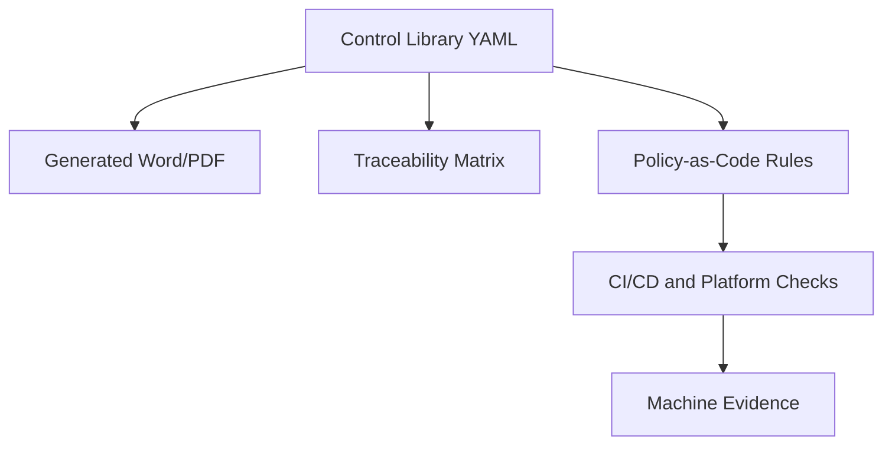

# DevSecOps Governance as Code

This repository is the starting structure for transforming the DevSecOps Control Baseline and DevSecOps Platform Reference Architecture into a Doc-as-Code and Policy-as-Code operating model.

## Purpose

The repository separates four concerns:

| Area | Purpose |
|---|---|
| `docs/source-documents` | Approved or working DOCX source documents brought into the repository for traceable migration. |
| `controls` | Structured DevSecOps control baseline requirements. |
| `platform` | Platform Reference Architecture levels and platform capabilities. |
| `traceability` | Mapping between controls, platform capabilities, evidence, and policy candidates. |
| `policies/opa` | Executable policy-as-code rules for automated checks. |
| `evidence` | Evidence type definitions expected from pipelines and platforms. |
| `waivers` | Waiver model and approval authority structure. |
| `schemas` | JSON Schemas for validating structured governance data. |
| `generated` | Generated DOCX, PDF, HTML, and XLSX outputs. |

## Target Model

The long-term target is that structured sources become the controlled master data for DevSecOps governance. Word and PDF remain important output formats for BMS, reviews, and audits, but they should be generated from the structured source where feasible.

## Initial Scope

The initial scope is based on:

- DevSecOps Control Baseline Standard aligned with Platform Levels
- DevSecOps Platform Reference Architecture Standard aligned with Control Baseline

The first implementation should focus on:

- Level 1 controls as complete structured data
- Platform Reference Architecture levels 1 to 3
- Traceability from control requirement to platform capability and expected evidence
- Initial automated checks for branch protection, SBOM, vulnerability evidence, artifact integrity, dependency source control, IaC, and waiver validity

## Recommended Workflow

1. Maintain structured control and platform data in YAML.
2. Validate YAML against JSON Schemas.
3. Generate traceability views and documents from YAML.
4. Implement policy-as-code only for controls that can be objectively checked.
5. Store generated evidence from pipelines and platform checks.
6. Use waivers only as controlled, time-limited exceptions.

## Important Principle

Not every requirement should become executable policy. Some requirements are governance obligations, some are evidence obligations, and some are enforceable technical gates. The repository keeps these concerns connected but distinct.
# devsecops-governance-as-code
