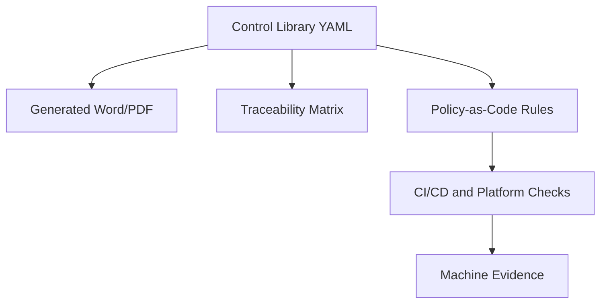

# DevSecOps Governance as Code

This repository is the starting structure for transforming the DevSecOps Control Baseline and DevSecOps Platform Reference Architecture into a Doc-as-Code and Policy-as-Code operating model.

## Purpose

The repository separates four concerns:

| Area | Purpose |
|---|---|
| `docs/source-documents` | Approved or working DOCX source documents brought into the repository for traceable migration. |
| `controls` | Structured DevSecOps control baseline requirements. |
| `platform` | Platform Reference Architecture levels and platform capabilities. |
| `traceability` | Mapping between controls, platform capabilities, evidence, and policy candidates. |
| `policies/opa` | Executable policy-as-code rules for automated checks. |
| `evidence` | Evidence type definitions expected from pipelines and platforms. |
| `waivers` | Waiver model and approval authority structure. |
| `schemas` | JSON Schemas for validating structured governance data. |
| `generated` | Generated DOCX, PDF, HTML, and XLSX outputs. |
| `architecture` | Runtime governance addendum data derived from the SDD Architecture Governance Framework. |

## Target Model

The long-term target is that structured sources become the controlled master data for DevSecOps governance. Word and PDF remain important output formats for BMS, reviews, and audits, but they should be generated from the structured source where feasible.



## Initial Scope

The initial scope is based on:

- DevSecOps Control Baseline Standard aligned with Platform Levels
- DevSecOps Platform Reference Architecture Standard aligned with Control Baseline

The first implementation should focus on:

- Level 1 controls as complete structured data
- Platform Reference Architecture levels 1 to 3
- Traceability from control requirement to platform capability and expected evidence
- Initial automated checks for branch protection, SBOM, vulnerability evidence, artifact integrity, dependency source control, IaC, and waiver validity

## Runtime Governance Addendum

The repository now includes a first runtime governance addendum for the SDD Architecture Governance Framework:

- `docs/runtime-governance-addendum.md`
- `architecture/quality-markers.yaml`
- `architecture/guardrails.yaml`
- `architecture/review-gates.yaml`
- `architecture/arch-l1.yaml`
- `architecture/arch-l2.yaml`
- `architecture/arch-l3.yaml`
- `architecture/arch-gov.yaml`
- `policies/opa/architecture_readiness.rego`
- `policies/opa/architecture_integration_readiness.rego`
- `policies/opa/architecture_operation_readiness.rego`
- `policies/opa/architecture_release_readiness.rego`

The addendum keeps the original framework document as the normative reference and adds machine-readable marker, guardrail, gate and policy artifacts for executable governance.

## Recommended Workflow

1. Maintain structured control and platform data in YAML.
2. Validate YAML against JSON Schemas.
3. Generate traceability views and documents from YAML.
4. Implement policy-as-code only for controls that can be objectively checked.
5. Store generated evidence from pipelines and platform checks.
6. Use waivers only as controlled, time-limited exceptions.

## Local Commands

Validate repository consistency:

```bash
python scripts/validate_governance_repo.py
```

Generate the first traceability CSV:

```bash
python scripts/generate_traceability_csv.py
```

Generate Policy/Directive governance traceability:

```bash
python scripts/generate_governance_traceability_csv.py
```

Generate the automation coverage report:

```bash
python scripts/generate_automation_report.py
```

Generate the CI/CD pipeline baseline report:

```bash
python scripts/generate_pipeline_baseline_report.py
```

Generate the architecture runtime traceability CSV:

```bash
python3 scripts/generate_architecture_traceability_csv.py
```

Validate the runtime governance addendum:

```bash
python3 scripts/validate_runtime_governance.py
```

Generate a demo architecture release-readiness input for `ha-CPsWMS`:

```bash
python3 scripts/collect_architecture_release_input.py \
  --repo /workspace/ha-CPsWMS \
  --output generated/demo/ha-cpswms-architecture-release-input.json \
  --release-id ha-CPsWMS-demo \
  --baseline ha-CPsWMS-demo-baseline
```

Generate a demo architecture governance report:

```bash
python3 scripts/generate_architecture_governance_report.py \
  --input generated/demo/ha-cpswms-architecture-release-input.json \
  --output-json generated/demo/ha-cpswms-architecture-governance-report.json \
  --output-md generated/demo/ha-cpswms-architecture-governance-report.md
```

Generate a demo DevSecOps governance report:

```bash
python3 scripts/collect_devsecops_release_input.py \
  --repo /workspace/ha-CPsWMS \
  --output generated/demo/ha-cpswms-devsecops-release-input.json \
  --release-id ha-CPsWMS-demo

python3 scripts/generate_devsecops_governance_report.py \
  --input generated/demo/ha-cpswms-devsecops-release-input.json \
  --output-json generated/demo/ha-cpswms-devsecops-governance-report.json \
  --output-md generated/demo/ha-cpswms-devsecops-governance-report.md
```

Generate the combined end-to-end demo report:

```bash
python3 scripts/generate_end_to_end_governance_report.py \
  --architecture-json generated/demo/ha-cpswms-architecture-governance-report.json \
  --devsecops-json generated/demo/ha-cpswms-devsecops-governance-report.json \
  --output-json generated/demo/ha-cpswms-end-to-end-governance-report.json \
  --output-md generated/demo/ha-cpswms-end-to-end-governance-report.md
```

The detailed live demo runbook is:

```text
docs/demo-end-to-end-governance.md
```

The reusable GitHub Actions template for application repositories is:

```text
pipeline-baseline/templates/github-actions/architecture-governance.yml
```

For the minimal copy-paste app-repo workflow and onboarding guide, see:

```text
pipeline-baseline/templates/github-actions/app-repo-architecture-governance.yml
pipeline-baseline/templates/github-actions/ADOPTION.md
```

Optional app-repo evidence templates are available in:

```text
pipeline-baseline/templates/app-architecture-evidence/
```

## Important Principle

Not every requirement should become executable policy. Some requirements are governance obligations, some are evidence obligations, and some are enforceable technical gates. The repository keeps these concerns connected but distinct.
