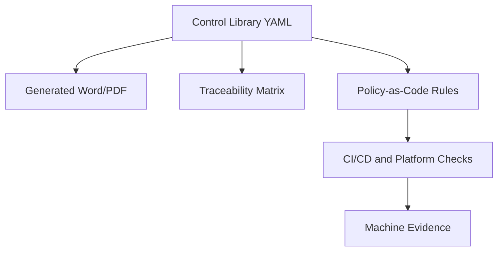

# DevSecOps Governance as Code

This repository is the starting structure for transforming the DevSecOps Control Baseline and DevSecOps Platform Reference Architecture into a Doc-as-Code and Policy-as-Code operating model.

The repository also models the governance stack above those standards: a `Policy` defines mandatory intent, a `Directive` defines binding operational execution, and the Standards define the detailed controls and platform expectations.

## Purpose

The repository separates four concerns:

| Area | Purpose |
|---|---|
| `docs/` | Human-readable governance documentation, onboarding guides, and operational explanations. |
| `docs/governance/source-documents` | Approved or working DOCX source documents brought into the repository for traceable migration. |
| `model/documents` | Structured catalog of policy, directive, and standard source documents. |
| `model/controls` | Structured DevSecOps control baseline requirements. |
| `model/platform` | Platform Reference Architecture levels and platform capabilities. |
| `model/traceability` | Mapping between controls, platform capabilities, evidence, and policy candidates. |
| `policies/opa` | Executable policy-as-code rules for automated checks. |
| `model/evidence` | Evidence type definitions expected from pipelines and platforms. |
| `model/waivers` | Waiver model and approval authority structure. |
| `schemas` | JSON Schemas for validating structured governance data. |
| `generated` | Generated DOCX, PDF, HTML, and XLSX outputs. |
| `releases` | Versioned baseline packages for controlled publication. |

## Target Model

The long-term target is that structured sources become the controlled master data for DevSecOps governance. Word and PDF remain important output formats for BMS, reviews, and audits, but they should be generated from the structured source where feasible.



## Initial Scope

The initial scope is based on:

- DevSecOps Control Baseline Standard aligned with Platform Levels
- DevSecOps Platform Reference Architecture Standard aligned with Control Baseline

The first implementation should focus on:

- Level 1 controls as complete structured data
- Platform Reference Architecture levels 1 to 3
- Traceability from control requirement to platform capability and expected evidence
- Initial automated checks for branch protection, SBOM, vulnerability evidence, artifact integrity, dependency source control, IaC, and waiver validity

## Recommended Workflow

1. Maintain structured control and platform data in YAML.
2. Validate YAML against JSON Schemas.
3. Generate traceability views and documents from YAML.
4. Implement policy-as-code only for controls that can be objectively checked.
5. Store generated evidence from pipelines and platform checks.
6. Use waivers only as controlled, time-limited exceptions.

## Repository Layout

- `docs/` explains the governance model for people.
- `model/` contains the machine-readable governance source of truth.
- `generated/` contains rendered documents, reports, and viewer output.
- `releases/` is reserved for versioned baseline packages.
- `.github/workflows/` contains repository automation and reusable CI integration.

## Local Commands

Validate repository consistency:

```bash
python scripts/validate_governance_repo.py
```

Review the governance document hierarchy:

```bash
sed -n '1,200p' docs/governance/governance-document-hierarchy.md
```

Run the lightweight regression checks:

```bash
python -m unittest discover -s tests
```

Read the practical usage guide:

```bash
sed -n '1,240p' docs/operations/how-to-use-this-repo.md
```

Read the beginner step-by-step operations guide:

```bash
sed -n '1,320p' docs/operations/beginner-step-by-step-operations-guide.md
```

Read how other repositories integrate this governance repository:

```bash
sed -n '1,320p' docs/onboarding/how-other-repos-use-this-governance-repo.md
```

Read the step-by-step central governance baseline integration guide:

```bash
sed -n '1,320p' docs/onboarding/how-other-repositories-use-the-central-governance-baseline.md
```

Read the application repository onboarding guide:

```bash
sed -n '1,260p' docs/onboarding/application-repo-onboarding.md
```

Read the explanation of policy, directive, baseline, verification, and governance as code:

```bash
sed -n '1,360p' docs/governance/policy-directive-baseline-verification-and-governance-as-code-explained.md
```

Read the explanation of the relationship between the control baseline and the platform architecture:

```bash
sed -n '1,320p' docs/platform/control-baseline-and-platform-architecture-relationship-explained.md
```

Use the generic GitHub Actions onboarding template:

```bash
sed -n '1,180p' examples/github-actions/workflows/application-devsecops-baseline-template.yml
```

Read the operational governance enforcement options:

```bash
sed -n '1,240p' docs/operations/operational-governance-enforcement-options.md
```

Generate an extended machine-readable governance compliance result:

```bash
python3 scripts/generate_governance_compliance_result.py \
  --target-repo . \
  --input-file policies/example-input.release-candidate.json \
  --output-file governance-compliance-result.json
```

GitHub Actions runs the same core checks automatically on pushes and pull requests via `.github/workflows/governance-ci.yml`.

Generate the first traceability CSV:

```bash
python scripts/generate_traceability_csv.py
```

Generate the governance document authority matrix:

```bash
python scripts/generate_document_control_matrix.py
```

Generate the open gap report:

```bash
python scripts/generate_open_gap_report.py
```

Render the Policy and Directive into review-ready files:

```bash
python scripts/render_governance_documents.py
```

Generate the static governance status viewer:

```bash
python scripts/generate_status_viewer.py
```

Build the documentation site locally:

```bash
python3 -m venv .venv-docs
. .venv-docs/bin/activate
pip install -r requirements-docs.txt
mkdocs build --strict
mkdocs serve
```

Read the full step-by-step MkDocs and GitHub Pages guide:

```bash
sed -n '1,360p' docs/operations/mkdocs-and-github-pages-step-by-step.md
```

Use the first versioned L1 baseline release package:

```bash
sed -n '1,240p' releases/l1/v1.0.0/baseline-package.md
sed -n '1,200p' docs/releases/l1-baseline-v1.0.0.md
```

Generate the central repository results index:

```bash
python3 scripts/generate_repository_results_index.py
sed -n '1,220p' status/repository-results-index.json
```

Run the local demonstration environment:

```bash
python scripts/run_demo.py
```

## Important Principle

Not every requirement should become executable policy. Some requirements are governance obligations, some are evidence obligations, and some are enforceable technical gates. The repository keeps these concerns connected but distinct.
